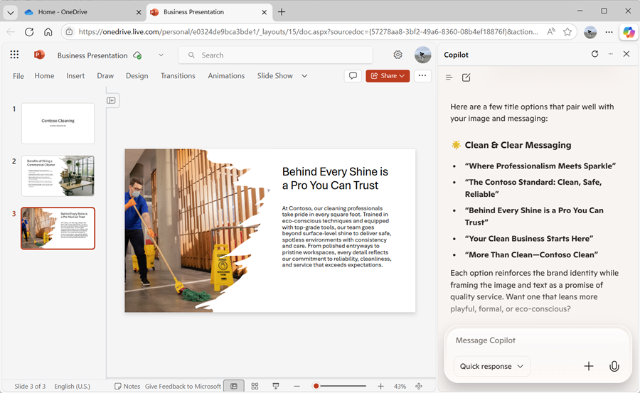

---
lab:
  title: Microsoft Edge で Copilot を探索する
---
# Microsoft Edge で Microsoft Copilot を探索する

Microsoft Copilot のエキサイティングな世界へようこそ。

この演習では、Copilot の力を利用して、企業向けクリーニング会社を設立するという新しいビジネス アイデアを探索します。

次のように想像してみてください: あなたはあらゆる場所のオフィススペースに革命を起こす一流のクリーニング サービスを開始しようとしています。 Microsoft Copilot を使用して、市場の傾向を調査し、堅実なビジネス プランを策定します。 しかし、それだけではありません。 魅力的なドキュメント、目を引くプレゼンテーション、説得力のあるメールを作成して、アイデアを実現させ、投資家を引き付けるのにも役立ちます。

この魅力的な対話型のラボをナビゲートしながら、創造性とビジネスの感覚を解き放つ準備をしましょう。 この演習の終わりまでに、起業家の成功への道を示す教材の包括的なセットが作成されます。 それでは作業を開始し、企業向けのクリーニング会社を実現しましょう。

> **重要**: この演習では、Copilot の操作に使用できるプロンプトを提供します。 これらは、Copilot の探索のための*出発点*として使用する必要があります。 これらのプロンプトを変更し、独自のプロンプトを追加して、Copilot との反復的なダイアログを利用し、生成された結果を調整することをお勧めします。 演習の手順で説明されている出力で終わるわけではありませんが、これで問題ありません。重要なのは Copilot を試してみることです。

この演習の所要時間は約 **40** 分です。

> **注**:この演習では、[個人用の Microsoft アカウント](https://signup.live.com) (outlook.com アカウントなど) があり、それを使用して、コンピューター上の [Microsoft Edge](https://www.microsoft.com/edge/download) にサインインしていることを前提としています。 職場アカウントと個人用アカウントの両方を持っている場合、Microsoft Edge の左上にあるアカウント設定で必ず*個人用*アカウントを選択してください。

## Copilot を使用してドキュメントを調べ、アイデアをリサーチする

生成 AI の探索を始めるために、Edge で Microsoft Copilot を使用して既存のドキュメントを調べ、そこから分析情報を抽出することにします。

1. Microsoft Edge で、`https://onedrive.live.com` の [OneDrive](https://onedrive.live.com) を参照し、個人用の Microsoft アカウントを使用してサインインします。表示されるウェルカム メッセージやオファーはすべて閉じます。
1. 他のブラウザー タブで、`https://github.com/MicrosoftLearning/mslearn-copilot/raw/main/Allfiles/Business%20Idea.docx` にある [Business Idea.docx](https://github.com/MicrosoftLearning/mslearn-copilot/raw/main/Allfiles/Business%20Idea.docx) ドキュメントを開きます。 そして、Edge でドキュメントが開いたら、**[コピーを編集]** するオプションを選択し、OneDrive にドキュメントをコピーします。 その後、ドキュメントは Microsoft Word で自動的にオンラインで開きます。

    > **ヒント**: コピーして編集するオプションが表示されない場合は、ローカル コンピューターにダウンロードします。 その後、**[+ 新規追加]** ボタンを使用して、**Business Idea.docx** ファイルをローカル コンピューターから OneDrive にアップロードします。

1. **Business Idea** ドキュメントでテキストを表示します。これには、ニューヨーク市のクリーニング ビジネスに関する大まかなアイデアが記載されています。
1. 次に示すように、Edge ツール バーの **Copilot** アイコンを使用して、[Copilot] ペインを開きます。

    ![Microsoft Edge の [Copilot] ペインのスクリーンショット。](./Media/edge-copilot.png)

    > **ヒント**: Microsoft Copilot は継続的に改善されています。 ユーザー インターフェイスが、表示されている画像と正確に一致しない場合があります。

1. [Copilot] ペインの下部にあるチャット ボックスに、次のプロンプトを入力します。

    ```prompt
    Summarize this document into 5 key points, and suggest next steps.
    ```

    メッセージが表示されたら、Copilot によるページへのアクセスを許可することを確認します。

1. Copilot からの応答を確認します。次に示すように、ドキュメントの要点がここに要約され、実行するフォローアップ アクションがいくつか提案されています。

    ![応答が示されている [Copilot] ペインのスクリーンショット。](./Media/copilot-response.png)

    > **注**:実際の応答は異なる場合があります。

    Copilot が提供するいくつかの有用なガイダンスがお役に立てば幸いです。 ただし、追加の質問がある場合は、より具体的な情報を求めることができます。

1. 次のプロンプトを入力します。

    ```prompt
    How do I go about setting up a business in New York?
    ```

1. 応答を確認します。この応答には、ニューヨークでビジネスを始めるのに役立つアドバイスと、リソースへのリンクがいくつか含まれているはずです。

    > **重要**: AI によって生成される応答は、Web 上で公開されている情報に基づきます。 これは、ビジネスを開始するうえで必要な手順を理解するのに役立つ場合がありますが、100% 正確であるという保証はなく、専門家のアドバイスの必要がなくなるわけではありません。

## Copilot を使用してビジネス プランのコンテンツを作成する

最初の調査を行ったので、Copilot を利用してクリーニング会社のビジネス プランを策定することにします。

1. Microsoft Edge で **Business Idea.docx** ドキュメントを開いたまま、[Copilot] ペインに次のプロンプトを入力します。

    ```prompt
    Suggest a name for my cleaning business.
    ```

1. 提案を確認し、クリーニング会社の名前を選びます (または、プロンプトの入力を続けて、より多くの提案の中から好みの名前を探します)。 いずれかを選択したら、「`Let's go with the first one.`」などと入力して Copilot に知らせます。
1. メイン ブラウザー ページで **Business Idea** ドキュメントが開かれたままなのを確認し、次のプロンプトを入力します。

    ```prompt
    Based on the contents of this document, create a business plan for my cleaning business.
    ```

1. 応答を確認します。 次に、[Microsoft Word] ペインの **[ファイル]** メニューで、新しい空白のドキュメントを作成します。 **[デザイナー]** ペインが開いたら閉じ、新しいドキュメントの名前を「*Document*」から「`Business Plan`」に変更します。
1. [Copilot] ペインで生成されたビジネス プランをコピーし、ビジネス プラン ドキュメントに貼り付けます。

    

1. [Copilot] ペインで、次のプロンプトを入力します。

    ```prompt
    Create a corporate logo for the cleaning company. The logo should be round and include an iconic New York landmark.
    ```

1. Copilot で生成された画像を確認します。

1. 他のプロンプトを使用しながらデザインを繰り返し (`Make it green and blue` など)、好みのロゴに仕上げていきます。

    > **ヒント**: Coplot でテキストを含む画像が生成されると、スペル ミスが発生することがあります。 満足のいく結果が得られるまで、さまざまなプロンプトを試してみてください。

1. 生成されたロゴを右クリックし、クリップボードにコピーします。 そして、次のように、ビジネス プラン ドキュメントの先頭にそれを貼り付けます。

    

1. Microsoft Word ブラウザー タブを閉じ、OneDrive に戻ります。

## Copilot を使用して財務予測を生成および視覚化する

Copilot のサポートを利用し、クリーニング ビジネス アイデアのビジネス プランのドラフトを作成しました。 次に、Copilot を使用して、ビジネス プランをさらに調整するのに役立ついくつかの計算を実行してみましょう。

1. [Copilot] ペインで、次のプロンプトを入力します。

    ```prompt
    Create a table of projected profits for the next 5 years, starting with this year. The profit this year should be $10,000 and it should increase by 12% each year.
    ```

1. 応答を確認します。今後 5 年間の予測利益のテーブルが含まれているはずです。
1. Excel でテーブルを編集するオプションが表示されている場合は、それを選択して、データのテーブルを使用して新しいブックを作成します。 それ以外の場合は、OneDrive タブに戻り、**(+)** ボタンを使用して新しい **Excel ブック**を追加します。 次に、Copilot ペインからブックにデータのテーブルをコピーします。

1. ブックの名前を「`Financial Projections`」に変更します。 次のようになります。

    

1. [Copilot] ペインで、次のプロンプトを入力します。

    ```prompt
    What's a good way to visualize these projections in a chart?
    ```

1. 応答を確認します。予測データを視覚化するいくつかの方法が推奨されているはずです。 次のプロンプトを入力します。

    ```prompt
    How do I create a line chart in Excel?
    ```

1. Copilot が提供するガイダンスに従って折れ線グラフを作成します。

    > **ヒント**: Excel で選択されている既定のデータ軸を調整する必要がある場合があります。 スプレッドシートでグラフを選択し、**[ グラフ]** タブで **[データの選択]** を選択します。 次に、**[グラフ]** ペインの **[データ]** タブで、**年**フィールドが水平ラベルになり、**予測利益**フィールドのみが行の値として使用されるように設定を変更します。

    

1. **[グラフ]** タブを閉じると、スプレッドシートにグラフが表示されます。

1. Microsoft Excel ブラウザー タブを閉じ、OneDrive に戻ります。

## Copilot を使用してプレゼンテーションの内容を作成する

Copilot を利用して、クリーニング ビジネスのビジネス プランを作成し、いくつかの財務予測を生成しました。 次に必要なのは、ビジネスを始めるための資金を提供してもらえるよう投資家を説得する効果的なプレゼンテーションです。

1. OneDrive に、新しい **PowerPoint プレゼンテーション**を追加します。 **[Designer]** ペインが自動的に開いた場合は、閉じます。 次に、プレゼンテーションの名前を「*Presentation*」から「`Business Presentation`」に変更します。

1. プレゼンテーションのタイトル スライドで、クリーニング会社の名前をタイトルとして、`Investor Opportunity` をサブタイトルとして入力します。
1. (タイトルと、2 つのコンテンツ プレースホルダーが含まれる) **[2 つのコンテンツ]** スライド レイアウトを使用して、新しいスライドを挿入します。
1. スライドのタイトルを `Benefits of Hiring a Commercial Cleaner` に変更します。
1. [Copilot] ペインで、次のプロンプトを入力します。

    ```prompt
    Write a summary of the benefits of using a corporate cleaning company for your business. The summary should consist of five short bullet points.
    ```

1. Copilot の応答をクリップボードにコピーし、左側のコンテンツ プレースホルダーに貼り付けます。 次に、プレースホルダー内のテキストを編集して、納得がいくまで再フォーマットします。
1. [Copilot] ペインで、次のプロンプトを入力します。

    ```prompt
    Create a photorealistic image of a clean office.
    ```

1. 好みの画像が Copilot によって生成されたら、それをクリップボードにコピーし、スライドの右側にあるコンテンツ プレースホルダーに貼り付けます。

    **[デザイナー]** ペインが自動的に開いた場合は、好みのスライド デザインを選択します。 その後、**[デザイナー]** ペインを閉じます。

1. 満足のいくスライドが作成されるまで、必要と思われる追加の再フォーマットを適用します。

    

1. 新しいブラウザー タブを開き、それを使用して `https://github.com/MicrosoftLearning/mslearn-copilot/raw/main/Allfiles/mopping.png` からローカル コンピューターに [mopping.png](https://github.com/MicrosoftLearning/mslearn-copilot/raw/main/Allfiles/mopping.png) 画像をダウンロードし、任意のフォルダーに保存します。
1. PowerPoint プレゼンテーションが含まれているブラウザー タブに戻り、[Copilot] ペインで、チャット ボックスの横にある **[+]** ボタンを使用して、**mopping.png** 画像を Copilot にアップロードし、プロンプト `What does this image show?` を追加します。
1. 応答を確認します。これは次のようになります。

    

1. 次のプロンプトを使用してフォローアップし、応答を確認します。

    ```prompt
    Would this image be helpful to promote a commercial cleaning business?
    ```

    Copilot は、同僚の意見を尋ねるのと同じ方法で画像を分析し、特定のビジネス シナリオに対するその有用性を評価しました。

1. PowerPoint で、以前と同様の **[2 つのコンテンツ]** レイアウトを使用した新しいスライドを追加します。 次に、コンテンツ プレースホルダーの 1 つで、**mopping.png** 画像をアップロードしてスライドに追加します。

1. [Copilot] ペインで、次のプロンプトを入力します。

    ```prompt
    Write a short paragraph to accompany this image, emphasizing the professionalism of the cleaning staff we employ.
    ```

1. 結果のテキストを確認し、スライド上の空のコンテンツ プレースホルダーにコピーし、必要に応じて編集および書式設定を行います。
1. [Copilot] ペインで、次のプロンプトを入力します。

    ```prompt
    Suggest a good title for a slide that contains the image and text.
    ```

1. スライドに提案されたタイトルを使用し、PowerPoint で [デザイナー] を使用してスライドの書式を設定します。 最終的には、次のようなスライドになります。

    

1. PowerPoint ブラウザー タブを閉じ、OneDrive に戻ります。

## Copilot を使用して資金調達会議を手配する

ビジネスを始めるための資料をいくつか作成してきました。 次は、スタートアップ企業に資金提供しようとしている投資家にアピールします。

1. OneDrive タイトル バーの左端にある**アプリ起動ツール** (&#8759;) を使用して、**Outlook** を開きます。

1. **[メール]** ページで、新しいメールを作成します。 **[宛先]** ボックスに自分のメール アドレスを入力し、**[件名]** を「`Business funding meeting request`」に設定します。
1. [Copilot] ペインで、次のプロンプトを入力します。

    ```prompt
    Write an email to a bank manager requesting a meeting to discuss funding for a commercial cleaning business. The email should be concise and the tone should be professional.
    ```
    
1. 次に示すように、生成されたコンテンツを使用してメールを完成させます。

    

    必要に応じて、自分宛てにメールを送信できます。

## 課題

これまで、Copilot を使用してどのようにアイデアを調査し、内容を生成するかを見てきました。それでは、さらに詳しく探っていきましょう。 新しい Copilot セッションを開始するには、チャット ボックスの横にある **[+]** メニューの **[新しいチャットを開始]** を選択します。 次に、この演習で学習した内容に基づいて、Copilot を使用して、組織での生成 AI の導入を提案する会議を計画してみてください。 作業を始めるためのいくつかのアイデアを次に示します。

- 企業向けの生成 AI と Microsoft Copilot の利点を調査し、生産性の利点、コスト削減、AI を既に正常に導入している組織の例に関する情報を見つけます。
- 会議の前に先に読んでおく記事として回覧できるディスカッション ドキュメントを作成します。
- ピッチの重要な要素を強調するためのデータや視覚化など、ケースの提示に使用できるプレゼンテーションを作成します。
- メールを作成して、同僚に会議について伝え、それに関するコンテキストを提供します。

独創性を自由に発揮しましょう。そして、Copilot が、情報を見つけ、文章を生成して練り上げ、画像を作成し、質問に答えることで、どのように自分を支援してくれるかを探ってください。

## まとめ

この演習では、Microsoft Edge で Copilot を使用して情報を見つけ、内容を生成しました。 Copilot で生成 AI を使用すると、生産性と創造性の向上に役立つことが、おわかりいただけたと思います。

この演習で使用した無料のサービスが非常に強力であることは間違いありません。しかし、[Microsoft 365 Copilot](https://www.microsoft.com/microsoft-365/enterprise/copilot-for-microsoft-365) などのサービスを使用すれば、さらに多くのことを実現できます。この Microsoft 365 Copilot では、Microsoft Copilot は、Windows および Microsoft Office の生産性向上アプリケーションに統合され、一般的なタスクに関する高度にコンテキスト化されたヘルプを提供します。 Microsoft 365 を使用すると、ビジネスのデータとプロセスに生成 AI の能力を取り込むことができ、同時に、既存の IT インフラストラクチャにも統合して、管理可能で安全なソリューションを確保できます。