---
lab:
  title: Microsoft 365 Copilot を探索する (Web バージョン)
  description: この演習では、以下のことを行います。
  ll harness the power of Copilot to explore a new business idea: starting a corporate cleaning company using the web versions of Microsoft 365 applications.'
  duration: 40 minutes
  level: 100
  islab: true
  primarytopics:
    - Microsoft 365
    - Microsoft 365 Copilot
---

# Microsoft 365 Copilot を探索する (Web バージョン)

Web ベースの Microsoft 365 アプリケーションを活用したエキサイティングな Microsoft 365 Copilot の世界へようこそ

この演習では、Copilot の力を利用して、Microsoft 365 アプリケーションの Web 版を使用して企業向けクリーニング会社を設立するという新しいビジネス アイデアを探っていきます。

次のように想像してみてください: あなたはあらゆる場所のオフィススペースに革命を起こす一流のクリーニング サービスを開始しようとしています。 Web 版アプリケーションで Microsoft Copilot を使って、市場の傾向を調査し、堅実なビジネス プランを策定します。 しかし、それだけではありません。 魅力的なドキュメント、目を引くプレゼンテーション、説得力のあるメールを作成して、アイデアを実現させ、投資家を引き付けるのにも役立ちます。

Microsoft 365 の Web 版を使った、この魅力的な対話型のラボを進めながら、創造力とビジネス センスを存分に発揮する準備をしましょう。 この演習の終わりまでに、起業家の成功への道を示す教材の包括的なセットが作成されます。 それでは作業を開始し、企業向けのクリーニング会社を実現しましょう。

> **重要**: この演習ではプロンプトを使って、Web 版の Microsoft 365 アプリで Copilot を操作します。 これらは、Copilot の探索のための*出発点*として使用する必要があります。 これらのプロンプトを変更し、独自のプロンプトを追加して、Copilot との反復的なダイアログを利用し、生成された結果を調整することをお勧めします。 演習の手順で説明されている出力で終わるわけではありませんが、これで問題ありません。重要なのは Copilot を試してみることです。

この演習の所要時間は約 **40** 分です。

> **注**:この演習では、**Microsoft 365 Copilot** ライセンスを必要とし、Web 版の Microsoft 365 アプリケーションを使用します。

## Microsoft 365 Web アプリの使用を開始する

ラボ演習を開始する前に、Web 経由で Microsoft 365 にアクセスする必要があります。 次のいずれかのプライマリ エントリ ポイントを使用します。

- **メイン ポータル**: [https://m365.cloud.microsoft/](https://m365.cloud.microsoft/) または [https://m365copilot.com](https://m365copilot.com)
- **すべてのアプリ**: [https://m365.cloud.microsoft/apps/](https://m365.cloud.microsoft/apps/)

次のリンクを使用して、個々のアプリケーションに直接アクセスすることもできます。
- **OneDrive**: [https://onedrive.cloud.microsoft/](https://onedrive.cloud.microsoft/)
- **Word**: [https://word.cloud.microsoft/](https://word.cloud.microsoft/)
- **Excel**: [https://excel.cloud.microsoft/](https://excel.cloud.microsoft/)
- **PowerPoint**: [https://powerpoint.cloud.microsoft/](https://powerpoint.cloud.microsoft/)
- **Outlook**: [https://outlook.office.com/](https://outlook.office.com/)

## Copilot を使用してドキュメントを調べ、アイデアをリサーチする

生成 AI の探索を始めるために、Copilot for Word (Web 版) を使用して既存のドキュメントを調べ、そこからいくつかの分析情報を抽出することにします。

1. Web ブラウザーで、`https://github.com/MicrosoftLearning/mslearn-copilot/raw/main/Allfiles/Business%20Idea.docx` にあるドキュメント [Business Idea.docx](https://github.com/MicrosoftLearning/mslearn-copilot/raw/main/Allfiles/Business%20Idea.docx) を開きます。 
1. ファイルが**ダウンロード** フォルダーにダウンロードします。
1. Web 上の **OneDrive** ([https://onedrive.cloud.microsoft/](https://onedrive.cloud.microsoft/)) に移動し、ダウンロードした **Business Idea.docx** ドキュメントをアップロードします。
1. **OneDrive** から、[https://word.cloud.microsoft/](https://word.cloud.microsoft/) に移動するか OneDrive でドキュメントをクリックして **Microsoft Word** (Web 版) で **Business Idea.docx** を開き (ウェルカム メッセージや新機能の通知は閉じます)、このドキュメントを確認します。ここには、ニューヨーク市のクリーニング ビジネスに関するおおまかなアイデアがいくつか記載されています。 メッセージが表示されたら、上部の **[編集を有効にする]** を選択します。

    > **ヒント**: **[ナビゲーション]** ペインを開いている場合は、閉じると、より多くのドキュメントを表示できます。

1. 次に示すように、Word Web ツール バーの **[Copilot]** アイコンを見つけて選択し、[Copilot] ペインを開きます (ビジュアル テーマは異なっている場合があります)。

    ![Microsoft Word の [Copilot] ペインのスクリーンショット。](./Media/copilot-word-pane.png)

1. [Copilot] ペインで、プロンプトに従って下部のテキスト領域に入力します。

    ```prompt
    Summarize this document into 5 key points, and suggest next steps.
    ```

1. Copilot からの応答を確認します。ここでは、次に示すように、ドキュメントの主要なポイントが要約されています。

    ![応答が記載された Word の [Copilot] ペインのスクリーンショット。](./Media/copilot-response-word.png)

    > 受け取る応答の具体的な内容は、生成 AI の性質によって異なる可能性があります。

    Copilot が提供するいくつかの有用なガイダンスがお役に立てば幸いです。 ただし、追加の質問がある場合は、より具体的な情報を求めることができます。

1. [Copilot] ペインに戻り、Copilot に次の質問を尋ねます。

    ```prompt
    How do I setup a new business in New York? Answer with a numbered list.
    ```

1. 応答を確認し、必要に応じて、引き続き追加の質問をします。 応答に問題がなければ、クリップボードにコピーします。 既存のテキストの後に Word ドキュメントに貼り付けます。 次に、ニューヨークでビジネスをセットアップするときに実行することの一覧を示すテキストを選択します。 [Copilot] アイコンを選択し、**[テーブルとして視覚化]** を選択します。

    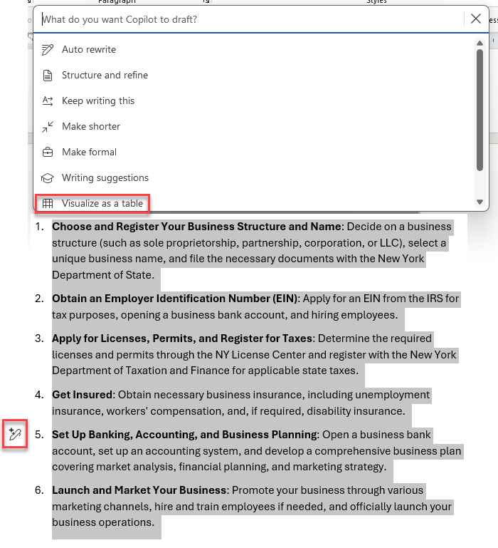

1. テーブルを確認し、詳細情報のためのリファレンスを含む列など、より多くの情報を追加するよう Copilot に求めます。  応答は次のようになります (場合によっては **[再生成]** ボタンを使用する必要があります)。

    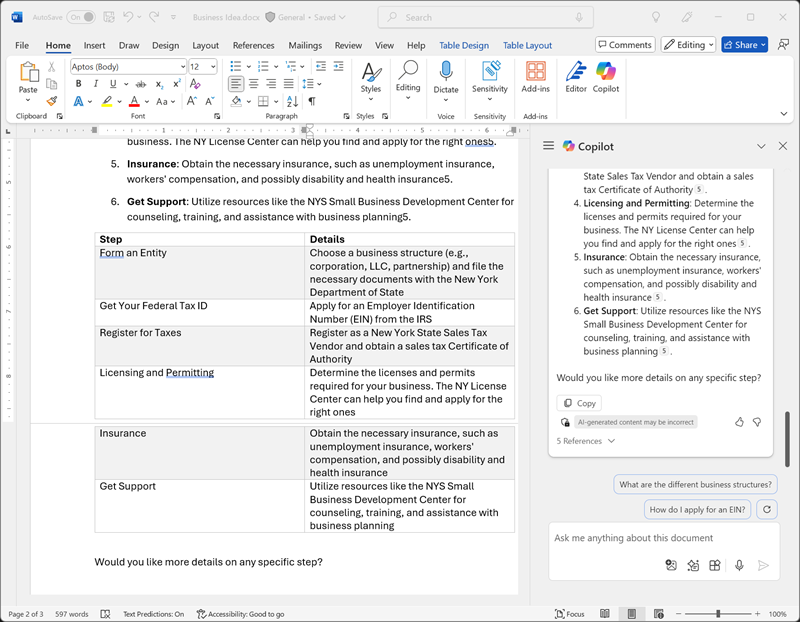

    > **重要**: AI によって生成される応答は、Web 上で公開されている情報に基づきます。 これは、ビジネスの立ち上げに必要な手順を理解するのに役立つ可能性がありますが、100% 正確であるという保証はなく、専門家のアドバイスの必要がなくなるわけではありません。

1. Copilot が生成したテーブルに満足したら、**保持する**のオプションを選択します。

## Copilot を使用してビジネス プランのコンテンツを作成する

最初の調査を行ったので、Word on the web を使って、Copilot を利用してクリーニング会社のビジネス プランを策定することにします。

1. Word on the web で **Business Idea.docx** ドキュメントを開いたまま、[Copilot] ペインに次のプロンプトを入力します。

    ```prompt
    Can you suggest a name for my cleaning business?
    ```

1. 提案を確認し、クリーニング会社の名前を選びます (または、プロンプトの入力を続けて、より多くの提案の中から好みの名前を探します)。
1. [https://word.cloud.microsoft/](https://word.cloud.microsoft/) に移動し、**新しい空白の文書**を選択して、新しい空白のドキュメントを作成します。 次に、新しいドキュメントで、余白の [Copilot] アイコンを選択して、新しい内容のドラフトを作成します。 次のプロンプトを入力します。**Contoso Cleaning** は任意の会社名に置き換えます。

    ```prompt
    Write a business plan for "Contoso Cleaning" based on the information in /Business Idea.docx. Include an executive summary, market overview, and financial projections.
    ```

    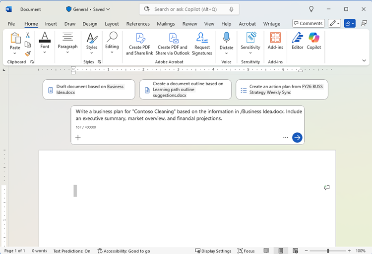

    > **ヒント**: プロンプトを入力し、「/」と入力すると、Copilot で OneDrive フォルダー内のドキュメントを参照できるようになります。 Copilot がドキュメントを提案しない場合は、OneDrive のインデックスがまだ完全に作成されていない可能性があります。 この場合は、プロンプトを `Write a business plan for "Contoso Cleaning", a commercial cleaning business in New York. Include an executive summary, market overview, and financial projections.` に変更します。

1. 応答を生成して確認します。 次に、応答を保持して、トーン、長さを調整するか、新しいプロンプトを使って再生成するように Copilot に要求します。 OneDrive フォルダーに **Business Plan.docx** として保存する前に、適切な見出しとスタイルをドキュメントに適用して、プロフェッショナルに見えるようにします。 ドキュメントは次のようになります。

    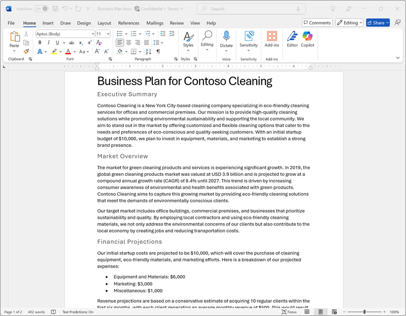

## Copilot for Excel で財務予測を視覚化する

ビジネス プランを準備できたので、財務予測のそのデータの一部を取得し、投資家へのメールやプレゼンテーションに含めることができるように、そのデータを視覚化するよう Excel on the web で Copilot に求めます。

1. Microsoft Word on the web で **Business Plan** ドキュメントを開いたまま、[Copilot] ペインを開きます。
1. 生成されたビジネス プランに予測利益の一覧が含まれている場合は、次のプロンプトを入力します。

    ```prompt
    Create a table of the projected profits in this document.
    ```

    そうでない場合は、次のプロンプトを入力します。

    ```prompt
    Create a table of projected profits for the next 5 years, starting with this year. The profit this year should be $10,000 and it should increase by 12% each year.
    ```

1. 予測利益のテーブルをクリップボードにコピーします。
1. [https://excel.cloud.microsoft/](https://excel.cloud.microsoft/) に移動して **Excel** on the web を開き、新しい空白のブックを作成します。 そのブックをすぐに **Financial Projections.xlsx** としてOneDrive フォルダーに保存します。
1. 利益予測のテーブルを Excel スプレッドシートに貼り付け、**それをテーブルとして書式設定を行います**。 手順は次のとおりです。
    1. データ内の**セル**を選択します。
    1. **[ホーム]** を選択し、[スタイル] で **[テーブルとして書式設定]** を選択します。 
    1. テーブルのスタイルを選択します。
    1. **[テーブルの作成]** ダイアログ ボックスで、セル範囲を確認または設定します。
    1. テーブルにヘッダーがあるかどうかをマークし、**[OK]** を選択します。
1. 売上予測をテーブルとして書式設定した状態で、Excel Web インターフェイスの **[ホーム]** タブから [Copilot] ペインを開き、次のプロンプトを入力します。

    ```prompt
    Suggest ways to visualize these financial projections.
    ```
    
1. Copilot から、データを視覚化する方法が提案され、新しいシートにピボット グラフを追加するように提示されます。

    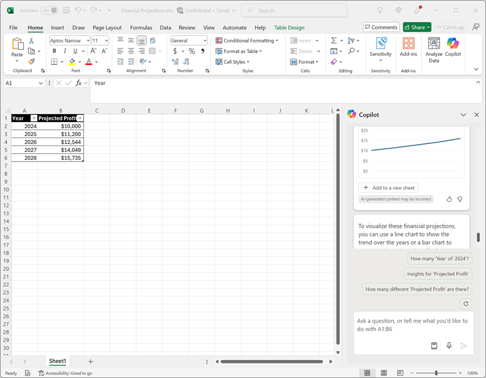

    > **ヒント**: Copilot がデータの別の形式を提案する場合は、後続のプロンプト `Visualize the data as a line chart.` を入力します。

1. Copilot 応答でオプションを選択して、ピボット グラフを新しいシートに追加して開きます。 グラフを選択し、**[デザイン]** を選択してスタイルの適用、グラフの種類の変更、その他のアクションを行います。 最終的に、次のようになります。

    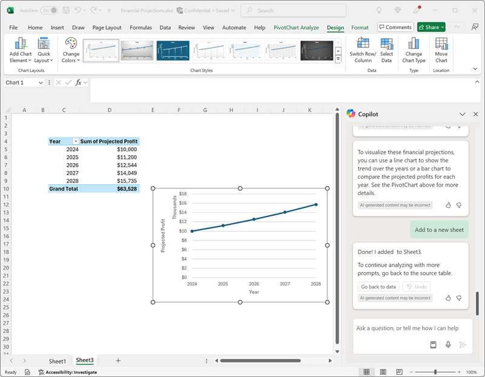

1. ブックを保存し、Excel Web タブを閉じます。

## Copilot を使用してプレゼンテーションの内容を作成する

Copilot の支援を得て、クリーニング事業のアイデアに関するビジネス プランのドラフトを作成し、財務予測を準備しました。 次に、PowerPoint on the web を使って、効果的なプレゼンテーションを用意して、このビジネスの利点を伝える必要があります。

1. [https://powerpoint.cloud.microsoft/](https://powerpoint.cloud.microsoft/) に移動して **PowerPoint** on the web を開き、新しい**空白のプレゼンテーション**を作成します。 **[Designer]** ペインが自動的に開いた場合は、閉じます。
1. プレゼンテーションを **Cleaning Company.pptx** として OneDrive フォルダーに保存します。
1. PowerPoint Web インターフェイスの **[ホーム] タブ**にある **[Copilot] ボタン**を選択し、**[作成するプレゼンテーションの内容]** を選択してから、[Copilot] ペインに次のようにプロンプトを入力します。

    ```prompt
    Create a presentation about a corporate cleaning service named "Contoso Cleaning" in New York City. The presentation should include the benefits of using a professional cleaning business.
    ```
1. プレゼンテーション デザインを確認し、**[スライドを生成する]** を選択します。

    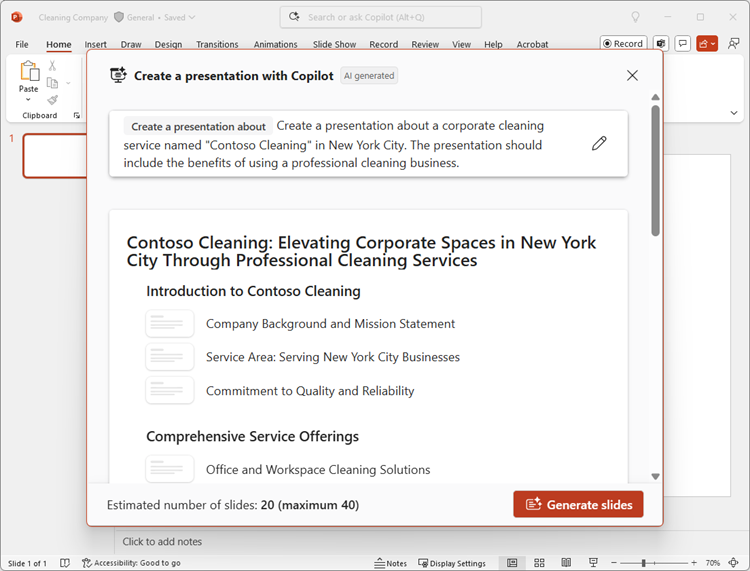
1. Copilot によってプレゼンテーションのスライドが生成されます。  このプロセスには数分かかる場合があり、テーマは異なりますが、出力は次のようになります。

    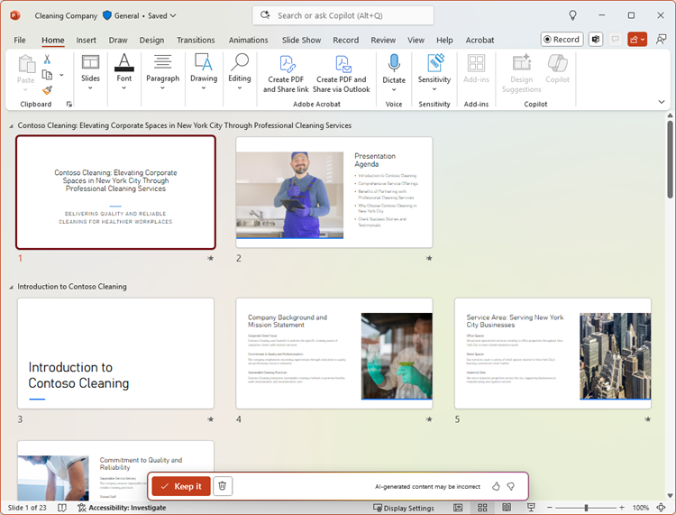

1. **[保持する]** を選択し、PowerPoint Web インターフェイスの右下で**ビュー**を**標準**に設定します。  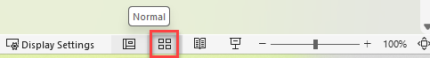

1. プレゼンテーションの最後から 2 番目のスライドを選択します (Copilot がスライドを生成した場合、最後の *まとめ*スライドの前)。 次に、[Copilot] ペインのチャット ボックスで、プロンプト `Add a slide about the benefits of an eco-friendly approach to cleaning.` を使用して新しいスライドを作成するように促します

    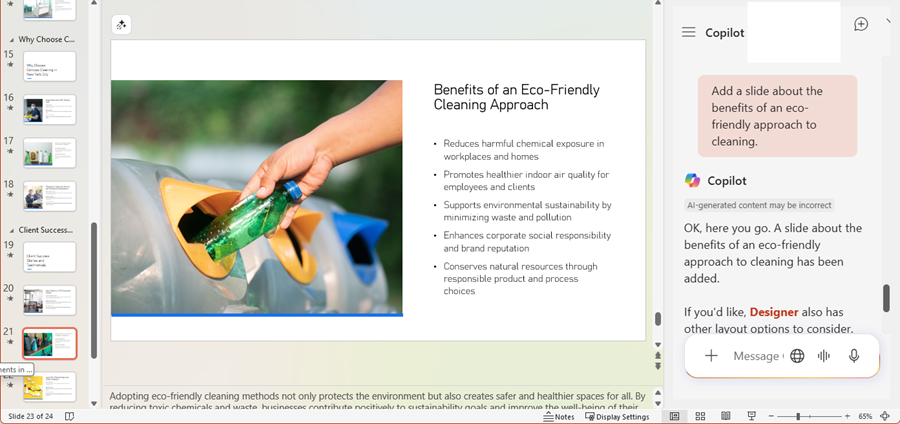

1. プレゼンテーションを保存し、PowerPoint Web タブを閉じます。

## Copilot を使用して資金調達会議を手配する

ビジネスを始めるための資料をいくつか作成してきました。 次は、Outlook on the web を使用して、スタートアップ企業に資金提供しようとしている投資家にアピールします。

1. [https://outlook.office.com/](https://outlook.office.com/) に移動して **Outlook** on the web を開き、タイトル バーで **Copilot** アイコンを使用して [Copilot] ペインを開きます。
1. **[カレンダー]** ページに切り替え、ビューを **[稼働日]** に変更します。 今週の予定表にスケジュールされたイベントがまだない場合は、Copilot が情報を使用できるように、いくつかのイベントを追加できます。
1. [Copilot] ペインで、次のプロンプトを入力します。

    ```
    What events do I have scheduled this week?
    ```

    Copilot は、その週にスケジュールされたイベントの概要で応答する必要があります。これは、スタートアップ資金を手配する銀行マネージャーとの会議の空き時間を特定するのに役立ちます。

1. **[メール]** ページに切り替えて新しいメールを作成し、**[宛先**] ボックスにご自分のメール アドレスを入力します。
1. **[Copilot を使って下書き]** するオプションを選択します。

    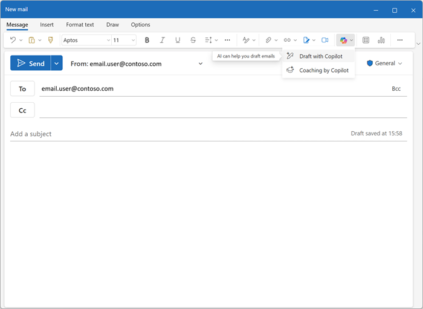
    
1. 下書きメールを生成するには、次のプロンプトを入力します。

    ```prompt
    Write an email to a bank manager requesting a meeting to discuss funding for a commercial cleaning business. The email should be concise and the tone should be professional.
    ```

1. Copilot を使用してメールの内容を調整し、**[保持]** を選択してメッセージを確定します。

    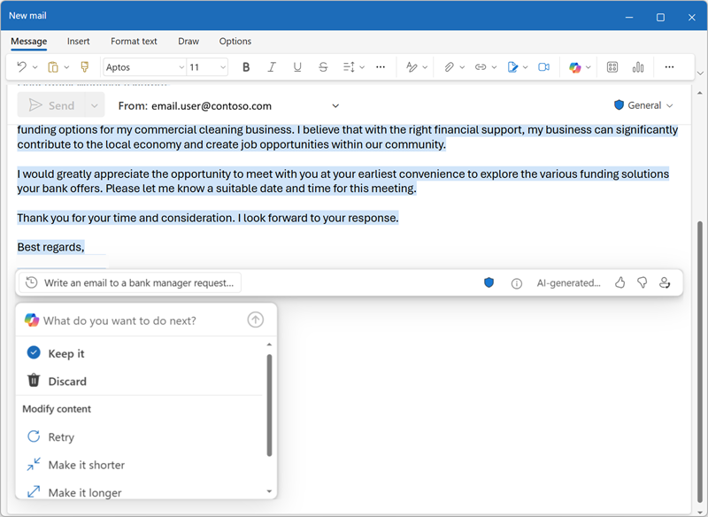

1. 必要に応じて、自分宛てにメールを送信できます。

## 課題

これまで、Web アプリケーションで Microsoft 365 Copilot を使用してどのようにアイデアを調査し、内容を生成するかを見てきました。それでは、さらに詳しく探っていきましょう。 

この演習で学習した内容に基づいて、Web 版の Microsoft 365 アプリで Copilot を使用して、組織での生成 AI の導入を提案するための会議を計画してみてください。 作業を始めるためのいくつかのアイデアを次に示します。

- 企業向けの生成 AI と Microsoft Copilot の利点を調査し、生産性の利点、コスト削減、AI を既に正常に導入している組織の例に関する情報を見つけます。
- 会議の前に先に読んでおく記事として回覧できるディスカッション ドキュメントを Word on the web を使用して作成します。
- ピッチの重要な要素を強調するためのデータや視覚化など、ケースの提示に使用できるプレゼンテーションを PowerPoint on the web を使用して作成します。
- Outlook on the web を使ってメールを作成して、同僚に会議について伝え、それに関するコンテキストを提供します。

独創性を自由に発揮しましょう。そして、Web ベースの Microsoft 365 環境内で Copilot が、情報を見つけ、文章を生成して練り上げ、画像を作成し、質問に答えることで、どのように自分を支援してくれるかを探ってください。

## まとめ

この演習では、Web 版の Microsoft 365 アプリケーションで [Microsoft 365 Copilot](https://www.microsoft.com/microsoft-365/enterprise/copilot-for-microsoft-365) を使用して情報を見つけ、内容を生成しました。 Copilot で生成 AI を使用すると、完全に Web ブラウザー内で操作するだけでも、生産性と創造性の向上に役立つことが、おわかりいただけたと思います。 Microsoft 365 Web アプリを使用することで、生成 AI の能力をビジネスのデータやプロセスに取り入れられると同時に、インターネット接続さえあればどこからでも柔軟に作業でき、管理しやすい安全なクラウドベースのソリューションを実現できます。
